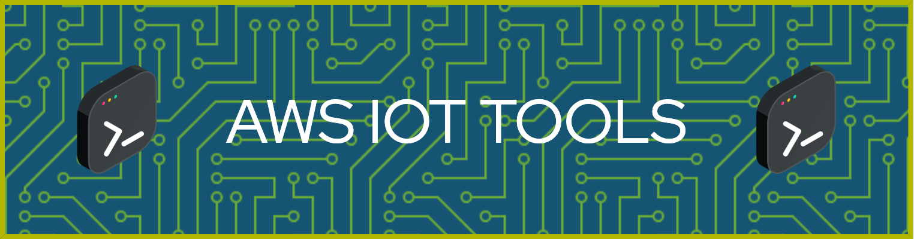

# AWS IoT Boilerplates and Practical Applications

## Description

Boilerplates and practical applications designed to streamline the development and deployment of solutions using AWS IoT. It features code samples and templates set up for a variety of devices, including the popular NodeMCU ESP8266, making it easier to integrate with AWS IoT for various use cases.

## Repository Contents

### Boilerplates

- **[NodeMCU ESP8266 Boilerplate](./nodemcu_esp8266_boilerplate/README.md)**: A basic template for getting started with IoT application development on NodeMCU ESP8266, integrated with AWS IoT. This boilerplate includes sample code and the necessary configurations to establish a secure connection with AWS IoT and start transmitting data.

### Practical Applications

_(More applications will be added soon)_

## How to Use

To utilize the boilerplates and applications in this repository, follow these steps:

1. Clone the repository to your local environment.
2. Navigate to the subfolder of the specific project you want to use (e.g., `nodemcu_esp8266_boilerplate`).
3. Read the specific `README.md` in each subfolder for detailed instructions on deploying and using the code.

## Requirements

To work with these boilerplates and applications, you will need:

- An AWS account with access to AWS IoT.
- The specific hardware required for each project
- Basic programming knowledge and familiarity with AWS IoT.
- Access to a Linux terminal or similar environments.
- Terraform CLI v1.6.5 or higher, as all cloud resource deployments are automated.

## Contributions

Contributions to this repository are welcome. If you wish to contribute, please:

1. Fork the repository.
2. Create a new branch for your changes.
3. Submit a pull request with a clear description of your enhancements or fixes.

## License

This project is licensed under [insert type of license here], allowing for widespread use and distribution. See the `LICENSE` file for more details.

## Contact

For any inquiries or comments, feel free to [open an issue](https://github.com/cgustav/aws-iot-tools/issues) in this repository.
