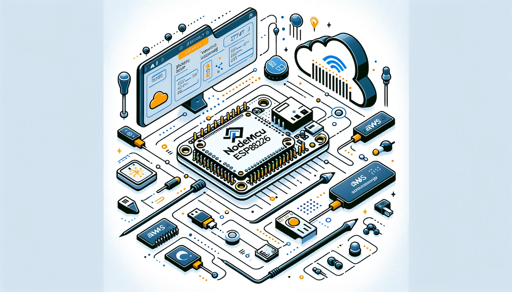

# NodeMCU ESP8266 Boilerplate

Kickstart your projects using the NodeMCU ESP8266 with AWS IoT. This boilerplate provides the essential code and configuration needed to connect your NodeMCU ESP8266 to AWS IoT, setting the stage for more complex developments.

## Content

- [Terraform Backend](./terraform/README.md)
- [ESP8266 Sketches](./sketches/README.md)

## What's Included

- Basic MQTT connection setup for AWS IoT.
- Example code for sending and receiving messages.
- Security best practices for handling credentials and certificates.

## Feedback and Contributions

Your feedback and contributions are welcome. If you have suggestions or want to contribute to this boilerplate, please follow our contributing guidelines.
